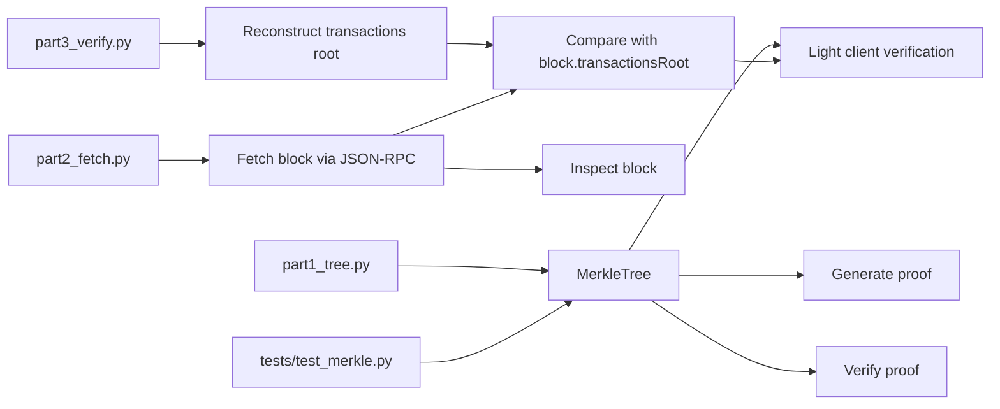

# Ethereum Merkle Tree Verifier


A Python implementation for building, proving, and validating Merkle inclusion paths for Ethereum transactions.

## ✨ What it does

| Part       | Description                                                                       |
| ---------- | --------------------------------------------------------------------------------- |
| **Part 1** | Build a Merkle tree, generate proofs, and verify inclusion locally                |
| **Part 2** | Fetch Ethereum block data from an RPC endpoint                                    |
| **Part 3** | Reconstruct the transactions root and validate proof paths against a block header |

It also includes the extension work for:

- **Extension A** — RLP + Keccak-256 transaction hashing
- **Extension B** — odd leaf duplication handling
- **Extension C** — light client style verification flow
- **Extension D** — historical block verification

## 🔖 Recommended GitHub topics / tags

Add these to the repository on GitHub to improve discoverability:

- `ethereum`
- `merkle-tree`
- `blockchain`
- `python`
- `cryptography`
- `ethereum-rpc`
- `light-client`
- `verification`

> To apply them: GitHub → Repository → Settings → General → Topics.

## 🧭 Architecture diagram



## 📁 Project structure

```text
ethereum-merkle-tree-verifier/
├── part1_tree.py
├── part2_fetch.py
├── part3_verify.py
├── requirements.txt
├── README.md
├── .env.example
├── docker-compose.yml
├── Dockerfile
├── tests/
│   └── test_merkle.py
```

## 🚀 Quick start

### 1. Clone and install

```bash
git clone https://github.com/DuvvuLakshmiPrasanna/Ethereum-merkle-tree-verifier.git
cd Ethereum-merkle-tree-verifier
python -m venv venv
venv\Scripts\activate
pip install -r requirements.txt
```

### 2. Configure your RPC endpoint

```bash
copy .env.example .env
```

Edit `.env` and set either of these values:

```env
ETH_RPC_URL=https://ethereum.publicnode.com
```

`part2_fetch.py` accepts either `RPC_URL` or `ETH_RPC_URL`, while the Docker setup uses `ETH_RPC_URL`.

### 3. Run the demos

```bash
python part1_tree.py
python part2_fetch.py
python part3_verify.py
```

### 4. Run the tests

```bash
pytest tests/ -v
```

## 🧪 What you will see

### Part 1

- A deterministic Merkle root
- Proof generation for each leaf
- Validation of valid and tampered proofs
- Odd leaf handling

### Part 2

- Ethereum block inspection
- `transactionsRoot`, `stateRoot`, gas usage, and transaction metadata

### Part 3

- Comparison between the block header root and the reconstructed root
- Proof generation for a chosen transaction index
- Validation of tampered and incorrect proofs
- Light client style verification path

## 🧠 How the verifier works

### Merkle tree mechanics

A Merkle proof for `carol` (index `2`) contains a sibling hash at each level. The verifier starts from the leaf hash, combines it with each sibling according to position (`left` or `right`), and compares the final digest with the expected root.

### Ethereum linkage

Every Ethereum block header includes a `transactionsRoot` that commits to the full transaction list. This project reconstructs the set of transaction hashes, rebuilds the Merkle tree, and checks whether the computed root matches the header root.

## 🛠️ Key design decisions

| Decision                      | Rationale                                                                |
| ----------------------------- | ------------------------------------------------------------------------ |
| Odd leaf duplication          | Matches the standard Merkle convention and keeps the tree balanced       |
| Standalone proof verification | Mirrors the light client model, where only the proof and root are needed |
| SHA-256 for Part 1            | Provides a clear, deterministic baseline for Merkle logic                |
| RLP + Keccak-256 for Part 3   | Matches Ethereum's native transaction hashing path                       |

## Historical block verification

```python
import os

from part2_fetch import fetch_block
from part3_verify import prove_transaction_inclusion

block = fetch_block(os.environ["ETH_RPC_URL"], 20_000_000)
prove_transaction_inclusion(block, tx_index=0)
```

## 🧾 Notes on Docker

The repo includes `docker-compose.yml` and `Dockerfile`, but the current Docker entrypoint is not aligned with the repository's Python scripts. For reliable local runs, use the Python commands directly unless you want to fix the Docker entrypoint separately.

## 📝 License

MIT
